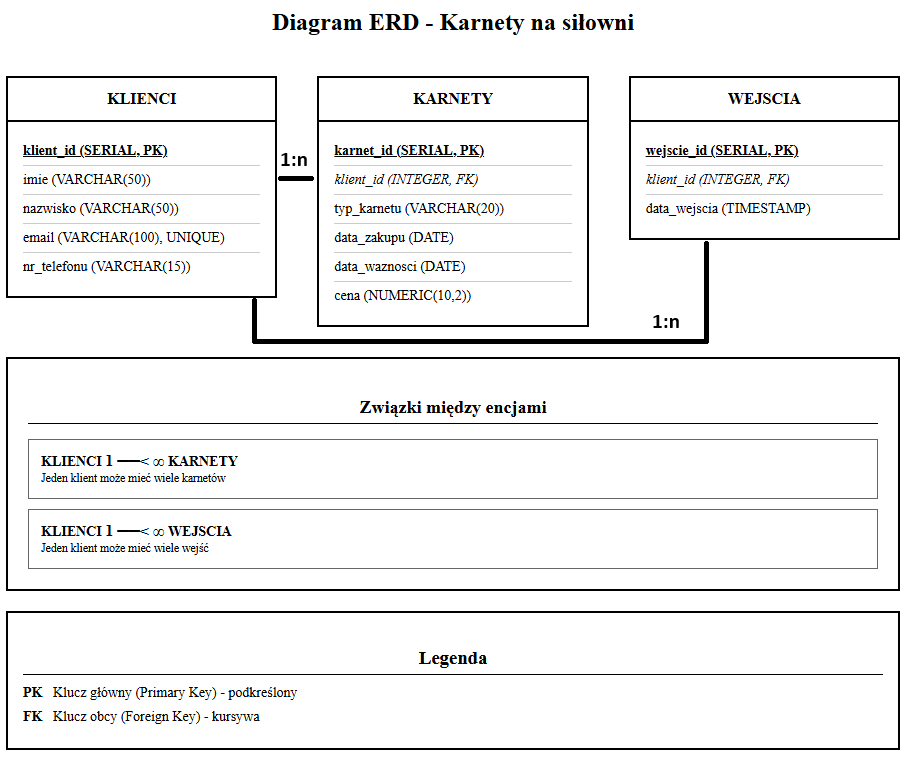

===========================================
3. Projekt bazy danych "Karnety na siłowni"
===========================================

W tym rozdziale szczegółowo przedstawiono proces projektowania i implementacji bazy danych, od modelu koncepcyjnego po fizyczną realizację.

Opis procesów biznesowych
---------------------------

System bazodanowy został zaprojektowany w celu wsparcia trzech fundamentalnych procesów biznesowych siłowni:

1.  **Rejestracja nowego klienta:** Proces polega na zebraniu podstawowych danych klienta (imię, nazwisko, dane kontaktowe) i zapisaniu ich w systemie. Każdy klient otrzymuje unikalny identyfikator. Proces ten jest realizowany poprzez operację `INSERT` na tabeli `Klienci`.
2.  **Sprzedaż i aktywacja karnetu:** Klient może zakupić jeden z dostępnych karnetów. System rejestruje typ karnetu, datę zakupu, oblicza datę ważności i zapisuje cenę transakcji. Karnet jest jednoznacznie powiązany z klientem, który go zakupił. Proces ten obsługuje operacja `INSERT` na tabeli `Karnety`, z kluczem obcym wskazującym na klienta.
3.  **Rejestracja wejścia na siłownię:** Przy każdej wizycie klienta, system weryfikuje, czy posiada on aktywny (ważny) karnet. Weryfikacja polega na wyszukaniu w tabeli `Karnety` rekordu powiązanego z danym klientem, którego `data_waznosci` jest późniejsza lub równa bieżącej dacie. Jeśli weryfikacja przebiegnie pomyślnie, system rejestruje wejście, zapisując identyfikator klienta i dokładny czas w tabeli `Wejscia`.

Model Koncepcyjny (ERD)
-----------------------

Model Logiczny
--------------

Model logiczny przekłada koncepcje na konkretną strukturę tabel, kolumn, typów danych i więzów integralności.

* **Tabela: Klienci**
    * `klient_id` (SERIAL, PK): Unikalny, automatycznie inkrementowany identyfikator klienta. Klucz główny.
    * `imie` (VARCHAR(50), NOT NULL): Imię klienta.
    * `nazwisko` (VARCHAR(50), NOT NULL): Nazwisko klienta.
    * `email` (VARCHAR(100), UNIQUE, NOT NULL): Adres e-mail, musi być unikalny, służy jako login lub do komunikacji.
    * `nr_telefonu` (VARCHAR(15)): Numer telefonu, opcjonalny.

* **Tabela: Karnety**
    * `karnet_id` (SERIAL, PK): Unikalny identyfikator transakcji zakupu karnetu.
    * `klient_id` (INTEGER, FK, NOT NULL): Klucz obcy wskazujący na klienta, który zakupił karnet.
    * `typ_karnetu` (VARCHAR(20), NOT NULL): Typ karnetu (np. 'miesieczny'). Ograniczony więzem CHECK.
    * `data_zakupu` (DATE, NOT NULL): Data, w której karnet został sprzedany.
    * `data_waznosci` (DATE, NOT NULL): Data, do której karnet jest ważny.
    * `cena` (NUMERIC(10, 2), NOT NULL): Cena zapłacona za karnet. Użycie typu `NUMERIC` zapobiega błędom zaokrągleń typowym dla typów zmiennoprzecinkowych.

* **Tabela: Wejscia**
    * `wejscie_id` (SERIAL, PK): Unikalny identyfikator zdarzenia wejścia.
    * `klient_id` (INTEGER, FK, NOT NULL): Klucz obcy wskazujący na wchodzącego klienta.
    * `data_wejscia` (TIMESTAMP, NOT NULL): Dokładna data i godzina wejścia. Wartość domyślna to `CURRENT_TIMESTAMP`.

Model Fizyczny (Kod SQL)
------------------------
Poniższy kod DDL (Data Definition Language) dla PostgreSQL tworzy opisaną strukturę bazy danych.

.. code-block:: sql
   :caption: Skrypt tworzący strukturę bazy danych
   :name: create-tables

   -- Tabela przechowująca dane klientów siłowni.
   -- Każdy klient jest unikalnie identyfikowany przez email.
   CREATE TABLE Klienci (
       klient_id SERIAL PRIMARY KEY,
       imie VARCHAR(50) NOT NULL,
       nazwisko VARCHAR(50) NOT NULL,
       email VARCHAR(100) UNIQUE NOT NULL,
       nr_telefonu VARCHAR(15)
   );

   -- Tabela przechowująca informacje o zakupionych karnetach.
   -- Więzy integralności (FOREIGN KEY z ON DELETE CASCADE) zapewniają,
   -- że usunięcie klienta spowoduje usunięcie jego karnetów.
   CREATE TABLE Karnety (
       karnet_id SERIAL PRIMARY KEY,
       klient_id INTEGER NOT NULL,
       typ_karnetu VARCHAR(20) NOT NULL,
       data_zakupu DATE NOT NULL,
       data_waznosci DATE NOT NULL,
       cena NUMERIC(10, 2) NOT NULL,

       CONSTRAINT fk_klient
           FOREIGN KEY(klient_id)
           REFERENCES Klienci(klient_id)
           ON DELETE CASCADE,

       CONSTRAINT chk_typ_karnetu
           CHECK (typ_karnetu IN ('miesieczny', 'trzymiesieczny', 'polroczny'))
   );

   -- Tabela rejestrująca wejścia klientów.
   -- Każde wejście jest powiązane z istniejącym klientem.
   CREATE TABLE Wejscia (
       wejscie_id SERIAL PRIMARY KEY,
       klient_id INTEGER NOT NULL,
       data_wejscia TIMESTAMP NOT NULL DEFAULT CURRENT_TIMESTAMP,

       CONSTRAINT fk_klient
           FOREIGN KEY(klient_id)
           REFERENCES Klienci(klient_id)
           ON DELETE CASCADE
   );